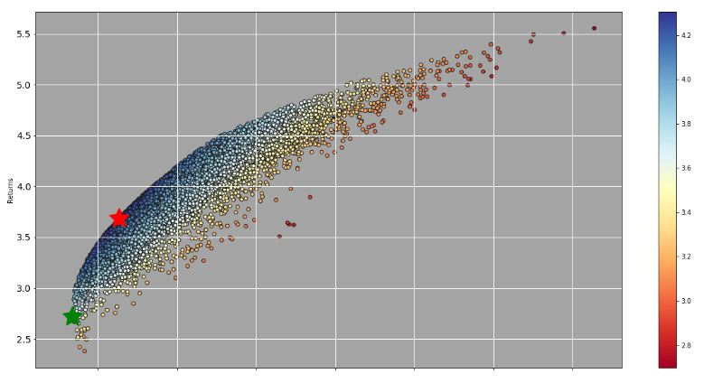

# Cryptocurrency portfolio Sharpe ratio optimization
This repository contains a Jupyter notebook with an investment strategy for cryptocurrency portfolios, although it could be generalized to other securities. 
 

 
The structure of the program is as follows:
- use api to read-in crypto price data 
- define functions to generate mean daily returns and a covariance matrix for our coins
- define function to randomly weight proportions of each coin in a portfolio and calculate the portfolio's risk-adjusted return ([Sharpe ratio](https://en.wikipedia.org/wiki/Sharpe_ratio)) and variance over a specified period of time
- use Monte-Carlo method to find weighting of coins to maximize Sharpe ratio and minimize volatility 
- plot all portfolios with stars on portfolios with highest Sharpe ratio and lowest volatility

